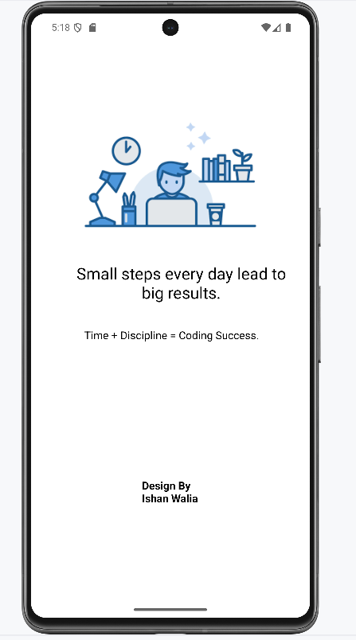
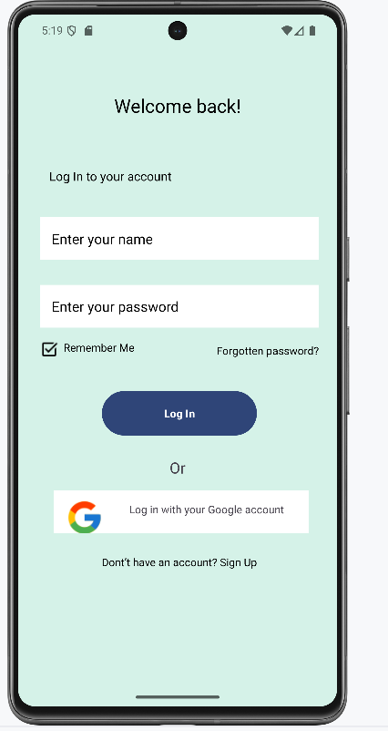
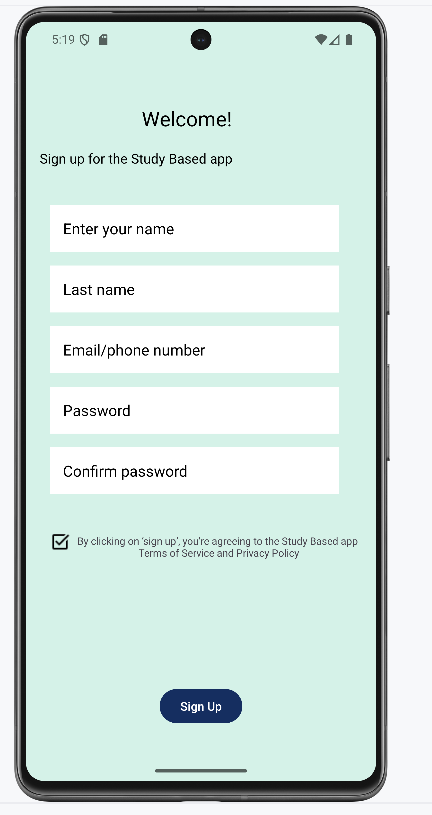
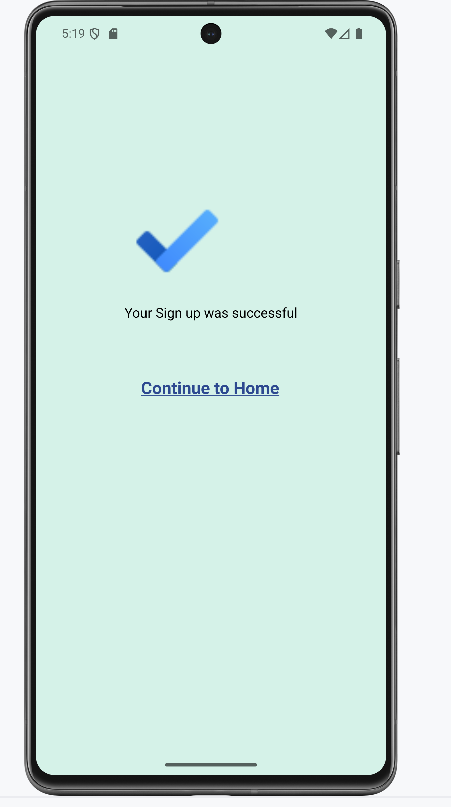

# Android Login & Signup App

A modern Android application built with **Kotlin** and **XML** that provides a complete authentication flow with beautiful UI screens.

## 📱 Features

- **Splash Screen** - Welcome screen with app logo and smooth transitions
- **Login Page** - User authentication with email and password fields
- **Signup Page** - New user registration with form validation
- **Success Screen** - Confirmation page after successful registration
- **Modern UI** - Clean, responsive design with custom drawables and animations
- **Navigation** - Seamless flow between activities using Android Intents

## 🛠 Tech Stack

- **Language**: Kotlin
- **UI Framework**: XML with ConstraintLayout
- **IDE**: Android Studio
- **Target SDK**: Android 14 (API 34)
- **Min SDK**: Android 24 (API 24)

## 📂 Project Structure

```
app/
├── src/main/
│   ├── java/com/example/loginsignuppage/
│   │   ├── SplashActivity.kt          # Splash screen activity
│   │   ├── LoginActivity.kt           # Login functionality
│   │   ├── SignupActivity.kt          # User registration
│   │   ├── successfulActivity.kt      # Success confirmation
│   │   └── MainActivity.kt            # Main activity
│   ├── res/
│   │   ├── layout/                    # XML layout files
│   │   │   ├── activity_splash.xml
│   │   │   ├── activity_login.xml
│   │   │   ├── activity_signup.xml
│   │   │   └── activity_signupsuccessful.xml
│   │   ├── drawable/                  # Custom drawables and icons
│   │   │   ├── background.xml
│   │   │   ├── button.xml
│   │   │   ├── blue_button.xml
│   │   │   └── freelancer.png
│   │   ├── values/                    # Resources
│   │   │   ├── colors.xml
│   │   │   ├── strings.xml
│   │   │   └── themes.xml
│   │   └── mipmap-*/                  # App icons
│   └── AndroidManifest.xml
├── build.gradle.kts                   # App-level build configuration
└── proguard-rules.pro                 # ProGuard rules
```

## 🚀 Getting Started

### Prerequisites

- Android Studio Arctic Fox or later
- Android SDK 24 or higher
- Kotlin 1.8.0 or later

### Installation

1. **Clone the repository**
   ```bash
   git clone https://github.com/your-username/Android-Login-Signup.git
   ```

2. **Open in Android Studio**
   - Launch Android Studio
   - Select "Open an existing project"
   - Navigate to the cloned directory

3. **Build and Run**
   - Sync project with Gradle files
   - Connect an Android device or start an emulator
   - Click the "Run" button or press `Shift + F10`

## 📱 Screenshots

<table>
   <center>
   <th>
   <th></th>
   <th></th>
   <th></th>
   </center>
</table>

## 🔧 Configuration

### Customization

- **Colors**: Modify `res/values/colors.xml` to change the app's color scheme
- **Strings**: Update `res/values/strings.xml` for text content
- **Themes**: Customize `res/values/themes.xml` for app theming
- **Drawables**: Replace images in `res/drawable/` folder

### Build Variants

The project supports different build variants:
- **Debug**: Development build with debugging enabled
- **Release**: Production build with optimizations

## 🎨 UI Components

- **Custom Buttons**: Styled with rounded corners and gradients
- **Input Fields**: Material Design text inputs with validation
- **Backgrounds**: Gradient backgrounds for visual appeal
- **Icons**: Custom app icons and UI elements

## 🔐 Security Features

- Input validation for email and password fields
- Secure text input for password fields
- Form validation before submission

## 📋 Activities Overview

### SplashActivity
- Displays app logo and branding
- Implements splash screen with timer
- Navigates to login screen after delay

### LoginActivity
- Email and password input fields
- Login button with validation
- Navigation to signup screen
- Basic authentication logic

### SignupActivity
- User registration form
- Input validation for all fields
- Terms and conditions checkbox
- Navigation to success screen

### SuccessfulActivity
- Registration confirmation message
- Success animation or icon
- Option to return to login

## 🛠 Development

### Adding New Features

1. Create new activity classes in the `java` package
2. Add corresponding XML layouts in `res/layout/`
3. Update `AndroidManifest.xml` with new activities
4. Implement navigation between activities

### Code Style

- Follow Kotlin coding conventions
- Use meaningful variable and function names
- Add comments for complex logic
- Maintain consistent indentation

## 🤝 Contributing

1. Fork the repository
2. Create a feature branch (`git checkout -b feature/AmazingFeature`)
3. Commit your changes (`git commit -m 'Add some AmazingFeature'`)
4. Push to the branch (`git push origin feature/AmazingFeature`)
5. Open a Pull Request

## 📝 License

This project is licensed under the MIT License - see the [LICENSE](LICENSE) file for details.

## 👨‍💻 Author

**Your Name**
- GitHub: [Ishanwalia](https://github.com/ishanwalia7579)
- Email: ishanwalia27@gmail.com

## 🙏 Acknowledgments

- Android Development Community
- Material Design Guidelines
- Kotlin Programming Language
- Android Studio Team

## 📞 Support

If you have any questions or run into issues, please:
1. Check the [Issues](https://github.com/your-username/Android-Login-Signup/issues) page
2. Create a new issue with detailed description
3. Contact the maintainer

---

⭐ **Star this repository if you found it helpful!**
